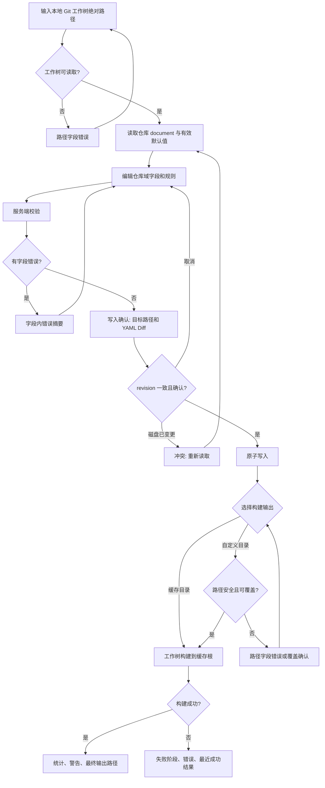

# M6 主路径与状态矩阵



| 环节 | 正常 | 异常/限制 | 用户下一步 |
|---|---|---|---|
| 选择 | 显示绝对路径输入 | 相对路径、非目录、工作树不可读 | 修改路径 |
| 编辑 | 显示来源与当前值 | YAML 解析失败、字段无效 | 查看行内错误，修正或保留原文件 |
| Diff | 仅显示受控字段变动 | 无变更 | 返回编辑，不显示写入按钮 |
| 写入 | 记录已写入路径 | token/权限/并发变更失败 | 重新读取，避免覆盖未知修改 |
| 输出 | 默认缓存；可输入会话级自定义绝对目录 | 危险路径、仓库关系、未知非空目录、已有 repolens 输出 | 修改路径或明确确认覆盖 |
| 构建 | 阶段、Stats、Warnings、最终路径 | source/config/theme/site/发布失败 | 查看失败阶段，返回配置或重试 |

## 布局替代（待 Pencil）

```text
+--------------------------------------------------------------------------------------------------+
| repolens ui  /Users/.../architecture-and-config-migration-scenarios/repolens   已修改  [Build] |
+-----------------------+--------------------------------------------------------------------------+
| Overview              | Site                                      Source: repository               |
| Site                  | Title [repolens _________________________________________________]         |
| View                  | Language [zh-CN v] Home [README.md _____________________________]          |
| Render                | Trust domain: source / output / access are external or CLI only.           |
| Rules (3)             |                                                                            |
| Theme                 |                                                      [Validate] [Save...] |
| Agent                 |                                                                            |
+-----------------------+--------------------------------------------------------------------------+
```

390px：导航进入菜单抽屉；规则进入独立子页；diff 为横向可滚动代码区；构建统计改为纵向列表。
